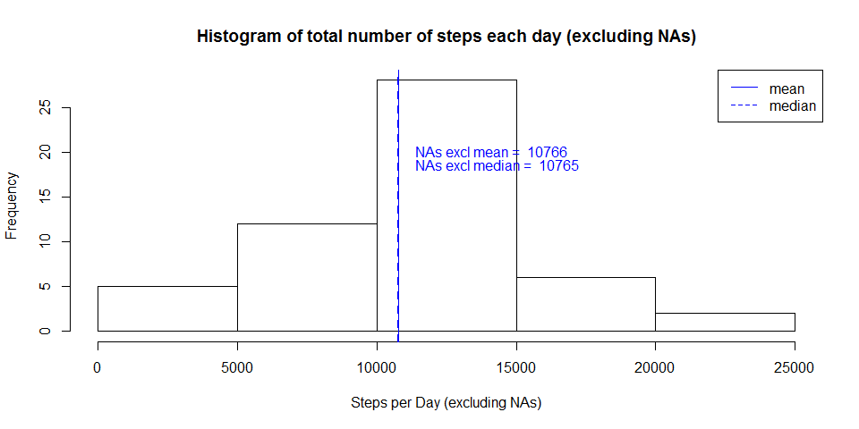
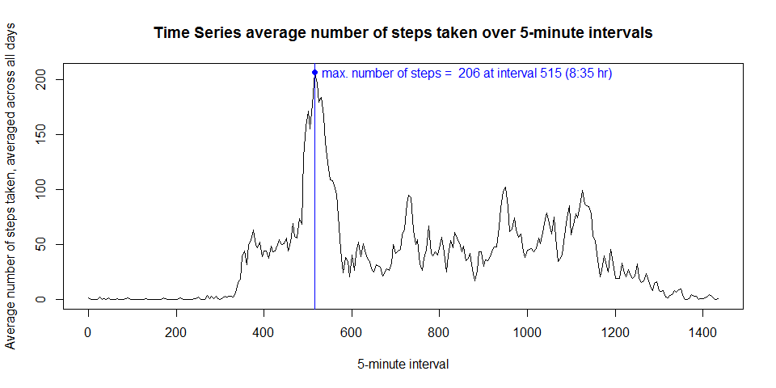
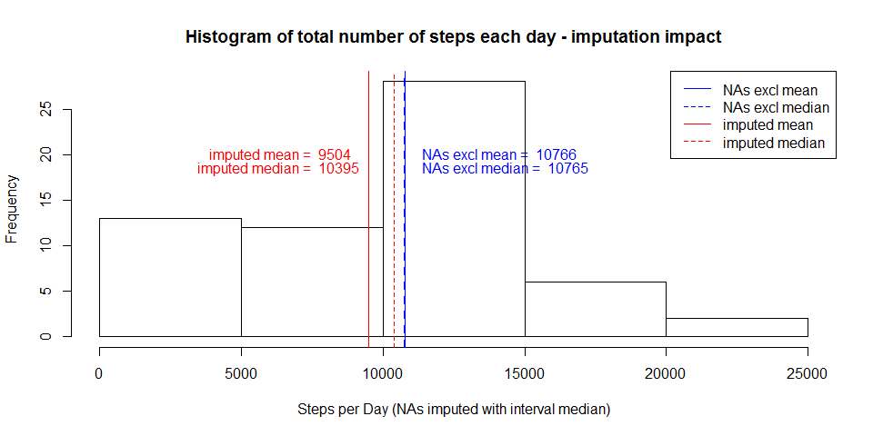
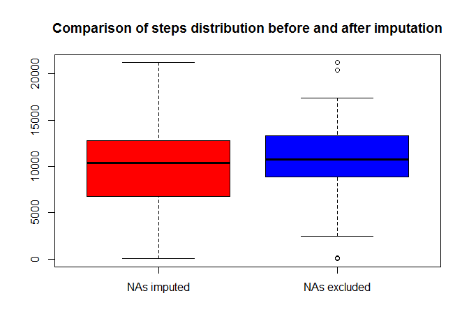
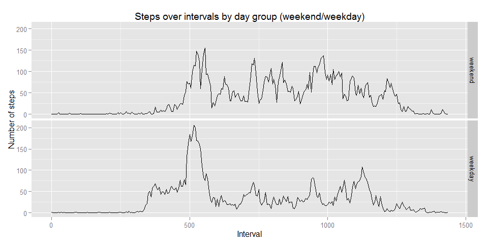

# Reproducible Research: Peer Assessment 1


## Loading and preprocessing the data

1. Load the data


```r
unzip("activity.zip")
activity <- read.csv("activity.csv")
```
2. Process/transform the data (if necessary) into a format suitable for your analysis


```r
library(dplyr)
```

```
## 
## Attaching package: 'dplyr'
## 
## The following objects are masked from 'package:stats':
## 
##     filter, lag
## 
## The following objects are masked from 'package:base':
## 
##     intersect, setdiff, setequal, union
```

```r
library(lubridate)

# convert date field to real date with lubridate
activity$date <- parse_date_time(activity$date,"%Y-%m-%d")

# convert steps to numeric
activity$steps <- as.numeric(activity$steps)

steps_day <- activity %>% group_by(date) %>% 
    summarise(steps_per_day = sum(steps))

steps_interval <- activity %>% group_by(interval) %>% 
    summarise(avg_per_interval = mean(steps,na.rm=TRUE),
              med_per_interval = median(steps,na.rm=TRUE))
```


## What is mean total number of steps taken per day?

1. Make a histogram of the total number of steps taken each day


```r
hist(steps_day$steps_per_day,
     main="Histogram of total number of steps each day (excluding NAs)",
     xlab="Steps per Day (excluding NAs)")

abline(v=mean(steps_day$steps_per_day,na.rm=TRUE),col="blue")

abline(v=median(steps_day$steps_per_day,na.rm=TRUE),col="blue",lty=2,lwd=2)

text(x=mean(steps_day$steps_per_day,na.rm=TRUE),y=20,
     labels=paste("NAs excl mean = ",format(mean(steps_day$steps_per_day,na.rm=TRUE),digits=1)),pos=4,offset=1,col="blue")
text(x=median(steps_day$steps_per_day,na.rm=TRUE),y=18.5,
     labels=paste("NAs excl median = ",format(median(steps_day$steps_per_day,na.rm=TRUE),digits=1)),pos=4,offset=1,col="blue")
```

 


2. Calculate and report the mean and median total number of steps taken per day

* Mean number of steps per day: **10766**
* Median number of steps per day: **10765**

## What is the average daily activity pattern?

1. Make a time series plot (i.e. type = "l") of the 5-minute interval (x-axis) and the average number of steps taken, averaged across all days (y-axis)


```r
# determine the interval with the highest number of steps
max_avg_steps_interval <- steps_interval[which.max(steps_interval$avg_per_interval),]$interval

# represent 5 minute interval as a time of day in 24hr time
max_interval_time <- paste(max_avg_steps_interval %/% 60, max_avg_steps_interval %% 60,sep=":")

# create line plot
with(steps_interval,plot(x=interval,y=avg_per_interval,type="l",
    xlab="5-minute interval",
    ylab="Average number of steps taken, averaged across all days",
    main="Time Series average number of steps taken over 5-minute intervals"))


# mark the point with the maximum steps in blue and add a label
abline(v=max_avg_steps_interval,col="blue",lwd=1)
text(x=max_avg_steps_interval,y=max(steps_interval$avg_per_interval),
     labels=paste("max. number of steps = ",
                  format(max(steps_interval$avg_per_interval),digits=1),
                  "at interval",max_avg_steps_interval,
                  paste0("(",max_interval_time," hr)")),pos=4,col="blue")
points(x=max_avg_steps_interval,y=max(steps_interval$avg_per_interval),
       pch=16,lwd=3,col="blue")
```

 

2. Which 5-minute interval, on average across all the days in the dataset, contains the maximum number of steps?

    The time 5-minute interval with the maxium average number of steps *(approx. 206 steps)* was at **835** or **13:55 hr**.


## Imputing missing values

1. Calculate and report the total number of missing values in the dataset (i.e. the total number of rows with NAs)

```r
# count the number of non-complete.cases
nrow(activity[!complete.cases(activity),])
```

```
## [1] 2304
```

2. Devise a strategy for filling in all of the missing values in the dataset. The strategy does not need to be sophisticated. For example, you could use the mean/median for that day, or the mean for that 5-minute interval, etc.

```r
# use median steps for that interval to impute missing values
activity_impute <- activity %>% 
    mutate(steps_impute = ifelse(is.na(steps),
            steps_interval[steps_interval$interval==activity$interval]$med_per_interval,steps))
```

3. Create a new dataset that is equal to the original dataset but with the missing data filled in.

```r
# replace steps with steps_impute
activity_impute <- activity_impute %>% select(steps=steps_impute,date,interval)
```

4. Make a histogram of the total number of steps taken each day and Calculate and report the mean and median total number of steps taken per day. Do these values differ from the estimates from the first part of the assignment? What is the impact of imputing missing data on the estimates of the total daily number of steps?


```r
steps_day_impute <- activity_impute %>% group_by(date) %>% 
    summarise(steps_per_day = sum(steps))
hist(steps_day_impute$steps_per_day,
     main="Histogram of total number of steps each day - imputation impact",
     xlab="Steps per Day (NAs imputed with interval median)")


abline(v=mean(steps_day_impute$steps_per_day),col="red")
abline(v=mean(steps_day$steps_per_day,na.rm=TRUE),col="blue")

abline(v=median(steps_day_impute$steps_per_day),col="red",lty=2)
abline(v=median(steps_day$steps_per_day,na.rm=TRUE),col="blue",lty=2,lwd=2)

text(x=mean(steps_day_impute$steps_per_day),y=20,
     labels=paste("imputed mean = ",format(mean(steps_day_impute$steps_per_day),digits=1)),pos=2,offset=1,col="red")
text(x=median(steps_day_impute$steps_per_day),y=18.5,
     labels=paste("imputed median = ",format(median(steps_day_impute$steps_per_day),digits=1)),pos=2,offset=2,col="red")


text(x=mean(steps_day$steps_per_day,na.rm=TRUE),y=20,
     labels=paste("NAs excl mean = ",format(mean(steps_day$steps_per_day,na.rm=TRUE),digits=1)),pos=4,offset=1,col="blue")
text(x=median(steps_day$steps_per_day,na.rm=TRUE),y=18.5,
     labels=paste("NAs excl median = ",format(median(steps_day$steps_per_day,na.rm=TRUE),digits=1)),pos=4,offset=1,col="blue")
```

 

* Mean number of imputed steps per day: **9504**
* Median number of imputed steps per day: **10395**

* *Mean number of steps per day (excluding NAs): **10766***
* *Median number of steps per day (excluding NAs): **10765***


```r
boxplot(steps_day_impute$steps_per_day,steps_day$steps_per_day,names=c("NAs imputed","NAs excluded"),col=c("red","blue"),main="Comparison of steps distribution before and after imputation")
```

 

* Impact to Mean from imputation: **1262**
* Impact to Median from imputation: **370**


## Are there differences in activity patterns between weekdays and weekends?

1. Create a new factor variable in the dataset with two levels -- "weekday" and "weekend" indicating whether a given date is a weekday or weekend day.


```r
# create day group factor variable to group days into weekend (Sunday=1,Saturday=7) or weekday
activity_impute$daygroup <- ifelse(wday(activity_impute$date,label=FALSE) %in% c(1,7),"weekend","weekday")
# order weekends first
activity_impute$daygroup <- ordered(activity_impute$daygroup,levels=c("weekend","weekday"))
```

2. Make a panel plot containing a time series plot (i.e. type = "l") of the 5-minute interval (x-axis) and the average number of steps taken, averaged across all weekday days or weekend days (y-axis).


```r
library(ggplot2)

# summaries by daygroup,interval
steps_interval_impute <- activity_impute %>% group_by(daygroup,interval) %>% 
    summarise(avg_per_interval = mean(steps),
              med_per_interval = median(steps))
# ggplot line plot with day group as facets (panels)
qplot(data=steps_interval_impute,x=interval,y=avg_per_interval,
      facets="daygroup~.",geom="line",main="Steps over intervals by day group (weekend/weekday)", ylab="Number of steps",xlab="Interval")
```

 

